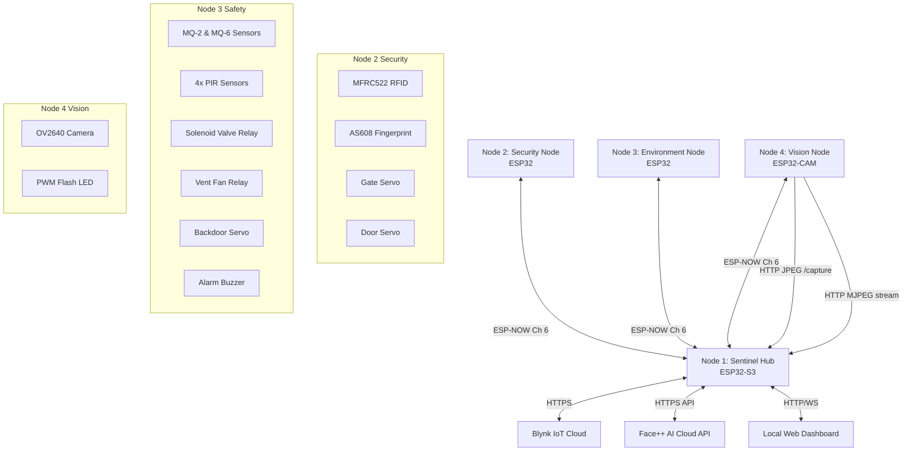
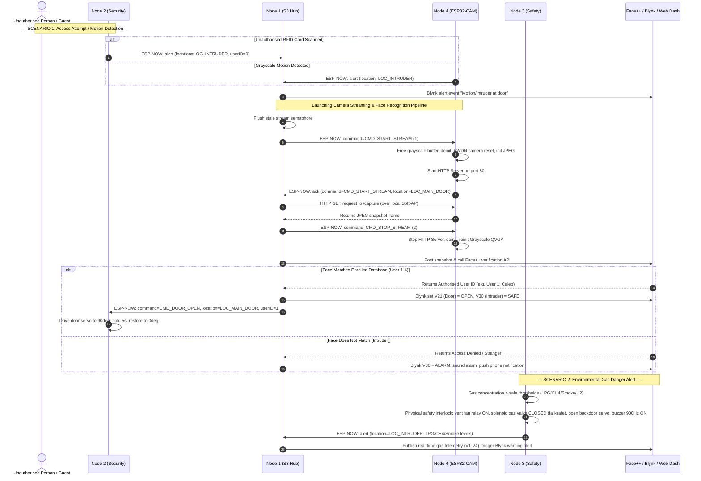

# Sentinel Home Intelligent System

An advanced, multi-node, voice-controlled smart home automation and safety mesh network built on the ESP32 platform. The system leverages custom ESP-NOW point-to-multipoint communication, hardware sensor validation, local speech recognition (ESP-SR and Edge Impulse), Blynk IoT cloud integration, and cloud-based AI face verification (Face++) to form an interconnected safety grid.

---

## 🗺️ System Architecture

The system consists of **four dedicated nodes** communicating over a private wireless channel (Channel 6) using custom ESP-NOW structured packets. **Node 1 (Hub)** acts as the central coordinator, connecting to the local Wi-Fi router to handle cloud telemetry, HTTP camera streaming, web dashboard rendering, and speech processing.



### 🔄 Multi-Node ESP-NOW Routing Sequence

The sequence diagram below visualizes the two primary operational sequences of the mesh grid: the **biometric camera verification pipeline** (Scenario 1) and the **environmental hazard safety interlock** (Scenario 2).



---

## 📦 Component Nodes Roles

### 🧠 Node 1: Sentinel Hub (ESP32-S3)
The brain of the system. It handles high-level coordinate tasks, local machine learning, and external network services.
* **Voice Recognition**: Employs Dual Speech Processing pipelines:
  * **ESP-SR (MultiNet7)**: For local offline recognition of 15 registered commands in English.
  * **Edge Impulse**: Optimized neural network wake-word routing.
* **Access Control Pipeline**: Coordinates security requests:
  * Spawns non-blocking pipeline tasks to request camera frames from Node 4.
  * Uploads captured snapshots to an image hosting service and invokes the **Face++ Cloud API** to verify identity.
* **AP Host**: Creates a local Soft-AP (`SENTINEL-HUB`) providing the network backbone for Node 4.
* **IoT Gateways**:
  * Hosts a locally embedded, highly responsive **Web Dashboard** with real-time telemetry (WebSocket-driven, features a lightbox viewer, slider-based PWM controls, and sensor logs).
  * Syncs telemetry and manual overrides with the **Blynk IoT App** via HTTPS Webhooks.

### 🔒 Node 2: Security Node (ESP32)
Manages localized door and gate ingress access control with integrated brownout fail-safes.
* **RFID Ingress**: Scans high-frequency RFID transceivers. Authenticates registered tokens (Caleb, Emmanuel, Mary, Princess) to open the Gate servo and reports entry to the Hub.
* **Biometric Ingress**: Polls UART fingerprint sensor (R307/AS608) to open the Door servo.
* **Intruder Alerting**: Reports unauthorized RFID cards and fingerprint failures to Node 1.
* **Remote Commands**: Acts on remote `CMD_DOOR_OPEN`/`CMD_DOOR_CLOSE` instructions sent by the Hub.

### 🛡️ Node 3: Environment & Environmental Safety Node (ESP32)
Provides continuous gas hazard surveillance and multi-zone motion tracking.
* **Toxic/Combustible Gas Monitoring**: Utilizes exponential power-law curves to measure **LPG, CH4 (MQ-6)** and **Smoke, Hydrogen (MQ-2)** in PPM.
* **Fail-Safe Safety Interlocks**:
  * In the event of gas levels exceeding safety thresholds, it activates local alarms: plays a 900Hz alarm tone, starts the ventilation fan, shuts down the solenoid gas valve, and swings open the emergency backdoor servo.
  * **Latching Logic**: Ventilation fan remains forced ON if gas levels return to normal but human presence is still detected in the room.
* **Multi-Zone PIR Tracker**: Debounces 4 PIR PIR inputs, sending intruder location coordinates to the Hub.

### 📷 Node 4: Vision Node (ESP32-CAM)
Autonomous vision tracking with on-demand streaming switching capabilities.
* **Detection Mode (Default)**: Camera operates in low-memory, fast-throughput **Grayscale QVGA (320×240)**. Performs frame differencing on a persistent PSRAM buffer. Sends ESP-NOW motion alerts to Node 1.
* **Streaming Mode**: When requested, it shuts down Grayscale detection, power-cycles the OV2640 via PWDN, reinitializes in **JPEG QVGA**, and boots an HTTP Server on port 80.
* **Web Services**: Serves MJPEG stream (`GET /`) and cache-busted single snapshots (`GET /capture`).
* **PWM Flash Light**: Leverages LEDC Timer 1 (Timer 0 used by camera XCLK) to control the high-power onboard LED. Automatically restores the user's manual slider brightness preference after streaming ends.

---

## 📡 Custom ESP-NOW Communication Protocol

All communication is strictly typed and packed into a `struct_message` payload. Transmission is performed point-to-multipoint on Wi-Fi Channel 6.

### Packet Structure (`struct_message`)
```cpp
typedef struct __attribute__((packed)) {
    char          name[10];     // Node signature ("NODE_1", "NODE_2", etc.)
    int           userID;       // Verified ID (1-4 for users; also carries PWM brightness)
    int           location;     // Area context (0=HB, 1=Gate, 2=Main Door, 3=Alert, 4=Backdoor)
    float         lpg;          // PPM value (Node 3 only)
    float         CH4;          // PPM value (Node 3 only)
    float         smoke;        // PPM value (Node 3 only)
    float         hydrogen;     // PPM value (Node 3 only)
    int           command;      // Action identifier (Command IDs listed below)
    unsigned long timestamp;    // Millisecond uptime ticket
} struct_message;
```

### Protocol Constants

| Value | Location Constant | Context |
|---|---|---|
| `0` | `LOC_HEARTBEAT` | Regular periodic keep-alive |
| `1` | `LOC_GATE` | Entry Gate (RFID & Gate Servo) |
| `2` | `LOC_MAIN_DOOR` | Main Entry Door (Fingerprint, Camera & Door Servo) |
| `3` | `LOC_INTRUDER` | Alert state (Motion, PIR zones, unauthorized cards) |
| `4` | `LOC_BACK_DOOR` | Secondary Egress Door (Environmental Servo) |

| Command ID | Command Constant | Description / Payload Action |
|---|---|---|
| `0` | `CMD_IDLE` | No action |
| `1` | `CMD_START_STREAM` | Switches Node 4 to JPEG format & launches HTTP Server |
| `2` | `CMD_STOP_STREAM` | Stops Node 4 HTTP Server & returns camera to Grayscale |
| `3` | `CMD_VENT_ON` | Forces ventilation fan relay ON |
| `4` | `CMD_VENT_OFF` | Restores ventilation fan relay to OFF (blocked if gas > safe) |
| `5` | `CMD_VALVE_ON` | Opens the solenoid gas line valve |
| `6` | `CMD_VALVE_OFF` | Closes the solenoid gas line valve (fail-safe shutoff) |
| `7` | `CMD_DOOR_OPEN` | Actuates target servo (Gate, Main Door, or Backdoor) to 90° |
| `8` | `CMD_DOOR_CLOSE` | Instantly drives target servo back to 0° (dashboard override) |
| `9` | `CMD_SET_FLASH` | Sets Flash LED duty cycle via `userID` field (0 - 255) |

---

## 🎛️ Blynk IoT Dashboard Mapping

Node 1 acts as the network proxy synchronizing the virtual pinboard to Blynk:

* **`V1`** (LPG Gauge): Gas concentration (0 - 10,000 ppm)
* **`V2`** (CH4 Gauge): Methane concentration (0 - 10,000 ppm)
* **`V3`** (Smoke Gauge): Smoke concentration (0 - 10,000 ppm)
* **`V4`** (Hydrogen Gauge): H2 concentration (0 - 10,000 ppm)
* **`V5`** (PIR Alert LED): System motion sensor trigger
* **`V20`** (Gate Button): Remote open gate (momentary switch to `CMD_DOOR_OPEN`)
* **`V21`** (Door Button): Remote open door (momentary switch to `CMD_DOOR_OPEN`)
* **`V22`** (Backdoor Button): Remote open backdoor (momentary switch to `CMD_DOOR_OPEN`)
* **`V23`** (Solenoid Gas Valve Switch): Toggle state (`CMD_VALVE_ON`/`CMD_VALVE_OFF`)
* **`V24`** (Ventilation Fan Switch): Toggle state (`CMD_VENT_ON`/`CMD_VENT_OFF`)
* **`V25`** (Node 4 Stream Switch): Toggle webcam live server (`CMD_START_STREAM`/`CMD_STOP_STREAM`)
* **`V28`** (Camera Flash LED Slider): Sets camera LED intensity (0 - 255)
* **`V30`** (Intruder Alert Indicator): Lights up when unauthorized entry occurs
* **`V40`** (Node 1 Hub Status LED): Diagnostics heartbeat
* **`V41`** (Node 2 Security Status LED): Diagnostics heartbeat
* **`V42`** (Node 3 Safety Status LED): Diagnostics heartbeat
* **`V43`** (Node 4 Vision Status LED): Diagnostics heartbeat

---

## ⚙️ Quick Start Installation & Building

### 🛠️ Hardware Requirements
* **Node 1**: ESP32-S3-WROOM-1 (with PSRAM, e.g., N16R8)
* **Node 2**: ESP32 Development Module + MFRC522 SPI RFID + AS608 UART Fingerprint + 2x SG90 Servos
* **Node 3**: ESP32 Development Module + MQ-2 + MQ-6 + 4x HC-SR501 PIR + 2-channel relay board + 1x SG90 Servo + 5V active buzzer
* **Node 4**: AI Thinker ESP32-CAM + OV2640 Camera

### 💻 Software Setup
1. **ESP-IDF v6.0**: Install on your machine (configured for Node 1 development).
2. **Arduino IDE / VS Code + Arduino Extension**: Configured with ESP32 Board Manager **v3.x** (for Nodes 2, 3, and 4).
3. **Libraries Required (Arduino)**:
   * `MFRC522` by GithubCommunity
   * `ESP32Servo` by John K. Bennett
   * `Adafruit Fingerprint Sensor Library` by Adafruit
   * `MQUnifiedsensor` by Miguel A. Califa

### 🚀 Building and Flashing
1. **Configure Node 1**:
   * Open Node 1 project folder in ESP-IDF terminal.
   * Edit `main/config.h` to set your WiFi credentials, Blynk tokens, and Face++ credentials.
   * Run the compile-flash command:
     ```bash
     idf.py build
     idf.py -p COMx flash monitor
     ```
2. **Configure Nodes 2, 3, and 4**:
   * Open the sketch (`.ino`) inside the corresponding directories (`NODE_2_4`, `NODE_3_fixed`, `NODE_4__6`) using Arduino IDE.
   * Ensure `ESPNOW_WIFI_CHANNEL` is set to your router's default channel (typically `6`).
   * Select your matching ESP32 board, set partitions to default, and click **Upload**.
3. **Verification**:
   * Keep Node 1 connected to a serial monitor. Monitor boot sequence, MultiNet7 registration, and Blynk IoT handshakes.
   * Power on Nodes 2, 3, and 4. You should see heartbeat confirmation prints in Node 1's console every 10 seconds.
